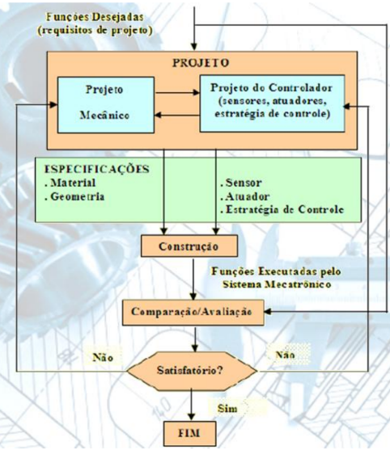
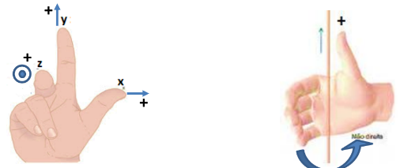

# O que é um robô?
# Elementos de um robô

- Interface com o operador;
- Sistema de supervisão;
- Sistema de controle;
- Efetuador;

# Definição de Robô
**Norma ISO 8373:2021**
- Robô: Mecanismo programado e acionado com certo grau de autonomia para realizar locomoção, manipulação ou posicionamento, incluindo sistema de controle.
- Robô Industrial: Manipulador multipropósito reprogramável e controlado automaticamente, programável em três ou mais eixos, podendo sr fixo em um local ou fixado a uma plataforma móvel para uso em aplicações de automação em ambiente industrial.
- Manipulador: Mecanismo contruído por um arranjo de segmentos, articulados ou deslizantes entre si, inclui atuadores do robô, não inclui um efetuador final, normalmente consiste no braço e no punho.
- Máquina autônoma capaz de realizar tarefas usando uma combinação de:
    - Sensores: para perceber o ambiente;
    - Atuadores: para agir no ambiente;
    - Um sistema de controle: para processar informações e tormar decisões;
- A norma também destaca algumas características importantes dos robôs:
    - Flexibilidade: capacidade e se adaptar a novas situações e tarefas;
    - Robustex: capacidade de operar em abientes incertos e dinâmicos;
    - Autonomia: capacidade de operar sem intervenção humana constante;
    - Interação social: capacidade de interagir com humanos de forma segura e natural.

# Divisão de um manipulador
- Efetuador: transmite e recebe todas as forças e torques do contato da superfície da ferramenta para com o material a ser trabalhado. Não faz parte do robô, uma vez que o efetuador pode ser outro robô.
- Punho: final do robô, receberá o efetuador.
- Eixo: possui todas as conexões com o "braço" do robô. Executa movimentos rotacionais ou lineares, sustentando e transmitindo forças e torques aos componentes que está conectado.
- Base: suporta todas as forças e torques aplicados, sendo a sustentação do robô.

# Concepção de projetos

## Sistemas passivos:
- Não possui capacidade de adaptação, devendo ser configurado de forma offline pela equipe.

## Sistemas ativos:
- Um sistema ativo é, geralmente, obtido por meio de realimentação de estados, os quais são obtidos por meio de sensores.
    - Sensores retornam as condições do ambiente e/ou do próprio robô.
    - Com essas informações sistemas adaptativos são criados, sistemas que se auto corrigem dependendo das informações adquiridas.

## Funções desempenhadas:
- As funções são os requisitos básicos de um sistema, ou seja, os requisitos do projeto.
- Concerne alguns fatores, como:
    - Quais são os objetivos do sistema?
        - Promover conforto térmico.
        - Promover segurança.
        - Montar e/ou desmontar peças.
        - Etc.
    - Quais são os usuários do sistema?
        - Indústria automobilística: operadores do sistema?
        - Indústria alimentícia: existirão operadores humanos?
        - Indústria eletrônica: quais/qual é o nível de preisão?
        - Etc.
## Fronteiras do sistema
- As fronteiras do sistema definem, a partir dos requisitos do projeto, quais serão os componentes do sistema.
    - Deverão considerar primordialmente:
        - Ambientes a serem condicionados: existem substrâncias que podem danificar os materiais dos robôs?
        - Equipamentos do sistema: dadas as condições do ambiente, quais são os melhores materiais para contruí-lo?
        - Haverá fluxo de outros materiais pelo sistema? Se o sistema conduzirá, por exemplo, outros fluidos, utilizaremos chillers, serpentinas, etc.?
    - É necessário considerar, sempre, se pessoas terão contato direto com o sistema.
    - A segurança no trabalho é um requisito necessário a todo sistema. É primordial que a vida humana seja preservada.
    - Quando pessoas tem contato direto com máquinas, o requisito de segurança do humano é de prioridade máxima.
    - A implementação do projeto é, na verdade, um processo iterativo, com revisões constantes dos procedimntos.
    - Diversas condições deverão ser atendidas, e, não é incomum necessitar reconsierar partes do projeto durante sua implementação, uma vez que muitas variáveis novas vão se apresentando ao longo do processo.
    - Considere:
        - Seleção de sensores e atuadores.
        - Modelagem do comportamento do sistema.
        - Elaboração de um algorítimo de controle.
        - Análise de validação do algorítimo de controle.
        - Elaboração do software de supervisão.
        - Etc.
## Seleção de sensores e atuadores
- Esta atividade está ligada diretamente ao custo/benefício para se implementar um sistema para os requisitos do projeto.
- Considere:
    - Precisão necessária: boa repetição das próprias medidas.
    - Acurácia necessária: proximidade da medida com a realidade.
    - resolução necessária: nível de discretização pode provocar perdas.
    - Magnitude do sinal medido/gerado: sensores apropriados.
    - Condições de operação: ambiente perigoso/danoso?
    - Característixas da resposta em frequência: qual a faixa dos ruídos? Existem artefatos de rede ekétrica (60Hz) ou qualquer outro tipo?
    - Relação sinal-ruído (signal-to-noise ratio): necessidade de filtragem?
    - Twmpo de execução/atuação necessária: Constante? Intercalada?
## Conceito de CIM
- CIM é sigla para Computer Integrated Manutacturing, ou, Manufatura Integrada por Computador.
- Projetos auxiliados por computadores, nos dias atuais, são primrdiais, em todos os apectps de todas as áreas.
- Contempla-se, basicamente:
    - Redes de computadores (comunicação).
    - Sistemas de processamento e controle de dados.
    - Armazenamento e compartilhamento de bancos de dados.
- Nas atividades auxiliadas por computadores, tem-se:
    - Computer Aided Design (CAD): Projeto auxiliado por computador.
    - Computer Aided Engineering (CAE): Análise auxiliada por computador.
    - Computador Aided Process Planing (CAPP): Planejamento de processos auxiliado por computador.
    - Computer Aided Manufacturing (CAM): Manufatura auxiliada por computador.

# Aspectos Construtivos de Manipuladores:
- Um manipulador mecânico é construído pela combinação de elementos estruturais rígidos e móveis.
- Os elementos rígidos, denominados por els ou links, estão conectados entre si por meio de estruturas móveis, denominadas juntas ou articulações.
- O primeiro elemento do robô é a base, e nela estão depositadas todas as forças e torques sofridos ou provocados pelo equipamento, em todos os instantes.
- O último elemento é a extremidade terminal, onde será vinculado o componente efetuador, ou end effector, (garras ou qualquer outra ferramenta para realização de atividades).
- O manipulador é comosto de uma sucessão de elos(links) e juntas, em que uma junta conecta dois elos permitindo o movimento relativo entre eles (rotações e translações).

## Graus de liberdade (GL ou DoF)
- Os graus de liberdade refere-se ao número de variáveis independentes necessárias para descrever completamente a posição e orientação de um sistema ou mecanismo robótico no espaço.
    - 6 é possível alcançar qualquer posição e orientação em 3D.

### Juntas, Articulações ou Joints.
- As juntas são conexões móveis entre as diversas partes rígidas (elos) que comõem um robô manipulador, e são fundamentais pois permitem o movimento relativo entre os elos.
- As principais são: rotativa, prismática, cilíndrica, esférica e planar.

#### Juntas rotacionais
- Giram em torno de uma linha imaginária estacionária chamada de eixo de rotação. Ela gira como uma cadeira giratória ou como uma dobradiça de portas. Possui 1GL.
#### Juntas prismáticas
- Movem em linha reta no eixo de deslocamento, executando um movimento de translação. São compostas de duas hastes que deslizam entre si. Possui 1GL.
#### Juntas cilíndricas
- É composta por duas juntas, uma rotacional e uma prismática. Possui 2GL.
#### Juntas planares
- É composta por duas juntas prismáticas. Possui 2GL.
#### Juntas esféricas
- É composta por três juntas rotacionais. Possui 3GL.
#### Outros tipos
- Juntas Helicoidais, Combinadas, Universais, Flexíveis, Magnéticas, Paralelas.

### Geometria de manipuladores
- Utilizam-se as três primeiras juntas do robô para classificá-lo, da seguinte maneira:
    - Robô articulado: RRR - Três juntas Rotacionais;
    - Robô cartesiano: PPP - Três juntas Prismáticas;
    - Robô esférico: RRP - duas primeiras Rotacionais e uma Prismática.
    - Robô cilíndrico: RPP - a primeira rotacional e duas prismáticas
    - Robô SCARA: RRP - Duas primeiras rotacionais e uma prismática.

## Sensores
### Sensor x Transdutor:
- Transdutor é um dispositivo que transforma um tipo de energia em outro, utilizando para isso um elemento sensor.
- Sensor é um dispositivo que responde a um estímulo físico ou químico de maneira específica e mensuravel.
    - Sensores Proprioceptivos: Fornecem informações sobre o estado interno do sistema, como a posição, o movimento e o equilíbrio de partes do corpo ou de componentes robóticos.
    - Sensores Exteroceptivos: São aqueles que captam infomrações do ambiente externo ao sistema ou organismo.
    - Sensores passivos: Apenas medem a energia que está sendo recebida diretamente do ambiente, sem interferir/influenciar no presente estado do ambiente.
    - Sensores ativos: Emitem sua própria energia para o ambiente, para depois captar a resposta (reação) que esta energia emitida produz.

# Transformações Homogêneas
## Frames
- Um frame e um conjunto de coordenadas geométricas utilizadas como referência para um determinado acontecimento.
- Em uma cena podem haver tantos frames quanto sejam necessários. Suas direções são estabelecidas pela regra da mão direita.

- frames podem descrever pontos e outros frames na mesma cena.
## Translações
- São deslocamentos do frame pelo espaço sem alterar a orientação dos eixos.
    - Também representa o movimento de uma junta prismática
$$
\begin{bmatrix}
X_1\\
Y_1\\
Z_1\\
1
\end{bmatrix}
=
\begin{bmatrix}
1 & 0 & 0 & \Delta x \\
0 & 1 & 0 & \Delta y \\
0 & 0 & 1 & \Delta z \\
0 & 0 & 0 & 1
\end{bmatrix}
\begin{bmatrix}
X_0\\
Y_0\\
Z_0\\
1
\end{bmatrix}
$$

## Escala
- O objeto é reescalado, aumentado ou diminuido, em um fator de escala dependendo dos valores.
$$
\begin{bmatrix}
X_1\\
Y_1\\
Z_1\\
1
\end{bmatrix}
=
\begin{bmatrix}
e_x & 0 & 0 & 0 \\
0 & e_y & 0 & 0 \\
0 & 0 & e_z & 0 \\
0 & 0 & 0 & 1
\end{bmatrix}
\begin{bmatrix}
X_0\\
Y_0\\
Z_0\\
1
\end{bmatrix}
$$

## Rotação
- Rotaçções são operações de mudança de orientação dos eixos cartesianos no espaço, chamadas ROLL(X), PITCH(Y) e YAW(Z).
    - Representam o movimento de uma junta rotacional.
### YAW
- Rotação ao redor do eixo Z.
$$
\begin{bmatrix}
X_1\\
Y_1\\
Z_1\\
1
\end{bmatrix}
=
\begin{bmatrix}
cos(\gamma) & -sen(\gamma) & 0 & 0 \\
sen(\gamma) & cos(\gamma) & 0 & 0 \\
0 & 0 & 1 & 0 \\
0 & 0 & 0 & 1
\end{bmatrix}
\begin{bmatrix}
X_0\\
Y_0\\
Z_0\\
1
\end{bmatrix}
$$
### ROLL
- Rotação ao redor do eixo X.
$$
\begin{bmatrix}
X_1\\
Y_1\\
Z_1\\
1
\end{bmatrix}
=
\begin{bmatrix}
1 & 0 & 0 & 0 \\
0 & cos(\alpha) & -sen(\alpha) & 0 \\
0 & sen(\alpha) & cos(\alpha) & 0 \\
0 & 0 & 0 & 1
\end{bmatrix}
\begin{bmatrix}
X_0\\
Y_0\\
Z_0\\
1
\end{bmatrix}
$$
### PITCH
- Rotação ao redor do eixo Y.
$$
\begin{bmatrix}
X_1\\
Y_1\\
Z_1\\
1
\end{bmatrix}
=
\begin{bmatrix}
cos(\beta) & 0 & sen(\beta) & 0 \\
0 & 1 & 0 & 0 \\
-sen(\beta) & 0 & cos(\beta) & 0 \\
0 & 0 & 0 & 1
\end{bmatrix}
\begin{bmatrix}
X_0\\
Y_0\\
Z_0\\
1
\end{bmatrix}
$$

# Cinemática Direta de Robôs Manipuladores
- Existem duas formas principais de modelagem de robôs:
    - Modelagem trigonométrica
    - Modelagem por transformação de frames
        - Convenção de Denavit-Hartenberg;
## Modelagem por transformação de frames
- Inicialmente, todas as juntas devem estar em sua configuração inicial, ou seja, juntas rotacionaos em 0° e prismáticas em 0m.
    - Este detalhe é importante pois permitirá que o projetista enxergue todos os detalhes originalmente construídos.
    - Definir o frame inercial.
        - Normalmente é escolhido a base como frame inercial, apesar de não cer obrigatório.
    - O frame de cada junta deve ser posicionado de forma ao eixo Z estar direcionado a seu eixo de atuação.
        - Os eixos X e Y são arbritários.
### Convenção de Denavit-Hartenberg
- Este método requer o cálculo de apenas quatro parâmetros, que serão usados para comport transformações homogêneas simples, e que fornecerão as coordenadas do elemento terminal.
- Nesta convenção, cada Transformação Homogênea (passagem de um frame para o outro), é representada por quatro transformações básicas, duas rotações e duas translações, comumente definidas em z e x, as quais serão designadas da seguinte forma:
$$
TH_{i-1}^{i}= A_i=T_z(d_i)R_z(\theta_i)T_x(a_i)R_x(\alpha_i)
$$
- Temos, portanto:
    - Translação em z, Rotação em z, Translação em x e Rotação em x.
        - Translações alinham origens, Rotações alinham eixos coordenados
- Resultando em:

$$
A_i
=
\begin{bmatrix}
cos(\theta_i) & -sen(\theta_i) cos(\alpha_i) & sen(\theta_i)sen(\alpha_i) & a_icos(\theta_i) \\
sen(\theta_i) & cos(\theta_i)cos(\alpha_i) & -cos(\theta_i)sen(\alpha_i) & a_isen(\theta_i) \\
0 & sen(\alpha_i) & cos(\alpha_i) & d_i \\
0 & 0 & 0 & 1
\end{bmatrix}
$$

- Então, utiliza-se Z como orientação do sentido de atuação da junta, além disso deve-se orientar o eixo X de forma a se planejar sua localização e orientação.
    - O eixo y não é usado.

- O algorítimo para a aquisição dos parâmetros de Denavit-Hartenerg $(\theta_i, \alpha_i,d_i,a_i)$ é simples.

### Método de Denavit-Hartenberg
- DH1: o eixo-$x_i$ é perpendicular ao eixo-$z_{i-1}$
- DH2: o eixo-$x_i$ interepta ao eixo-$z_{i-1}$